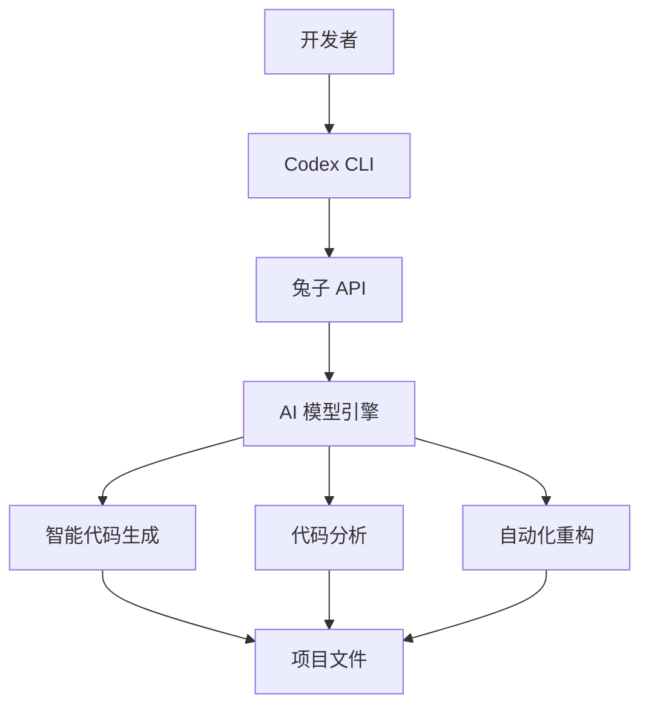
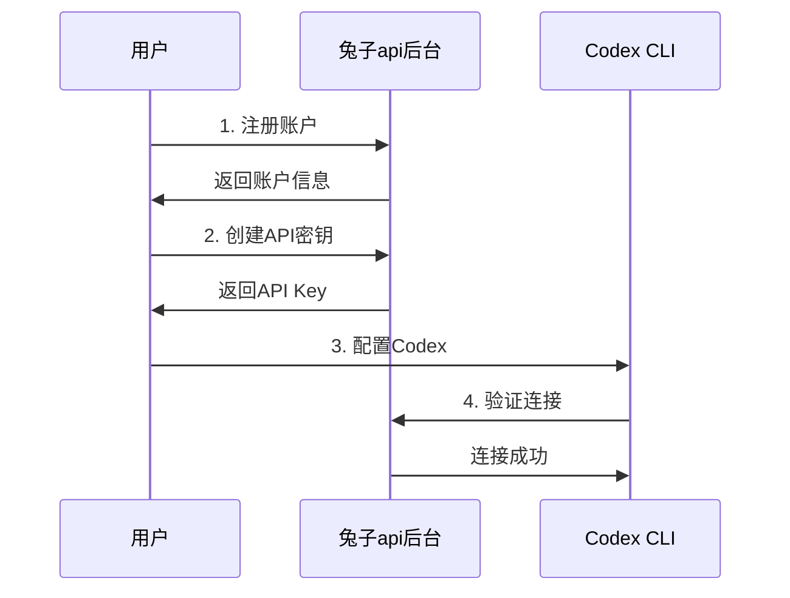
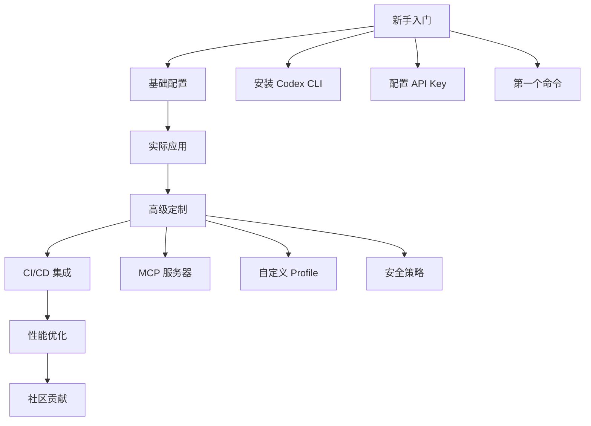

# ⚙️ Codex + 兔子API 配置

# Codex 使用教程

> **Open AI 下的 Codex 编程工具** - 基于官方 Codex 配置 兔子 API 中转的强大AI编程工具！

## 平台概览



## 系统需求与兼容性

| 组件  | 需求  | 推荐配置 | 优化建议 |
|-----|-----|------|------|
| **操作系统** | macOS 12+ / Ubuntu 20.04+ / Windows 10+ (WSL2) | macOS 13+ / Ubuntu 22.04+ | 使用 SSD 存储提升性能 |
| **Git** | 2.23+ (可选) | 2.40+ | 启用 PR 助手功能 |
| **内存** | 4 GB 最低 | 8 GB+ | 16 GB 适合大型项目 |
| **Node.js** | 18+ | 22+ LTS | 使用 nvm 管理版本 |
| **存储空间** | 500 MB | 2 GB | 预留日志和缓存空间 |

## 1. 一键安装指南

### 安装方式选择

**NPM 包安装** (通用推荐)

```bash
#  全局安装
npm i -g @openai/codex

# 备用方案
# npm i -g @openai/codex@native

#  验证安装
codex --version
```

**Homebrew 安装**  (macOS 推荐)

```bash
#  更新 Homebrew
brew update && brew upgrade

#  安装 Codex
brew install codex

#  验证安装
codex --version
```

**Homebrew 专属功能**

```bash
brew services start codex    # 后台服务
brew upgrade codex          # 升级版本
```

### 故障排除与优化

| 问题  | 解决方案 | 预防措施 |
|-----|------|------|
| `codex` 命令不存在 | `npm config get prefix` 检查PATH | 使用 `npx @openai/codex` |
| Node 版本过旧 | `nvm install 22 && nvm use 22` | 配置自动版本切换 |
| 权限问题 | `sudo npm i -g @openai/codex` | 配置 npm 全局目录 |

## 2. 兔子 API 配置指南

### API Key 获取流程



### 账户注册

**快速注册  https://api.tu-zi.com**

**访问官方平台**

```
 URL: https://api.tu-zi.com                           
```

### API 密钥管理

**创建 API 密钥（需要使用 Codex 或 原价分组的令牌）**

**操作步骤**


1. **登录控制台**

   ```
    https://api.tu-zi.com/panel                           
   ```

 


2. **生成 API Key**

   ```bash
   # 密钥格式示例
   sk-xxxxxxxxxxxxxxxxxxxxxxxxxxxxxxxx
   ```

 

**安全最佳实践**

* 定期轮换 API 密钥
* 使用环境变量存储
* 设置合理的使用限额
* 避免在代码中硬编码

### Codex 配置

**配置文件生成器**

**配置目录初始化** Codex 启动时会在 \~/.codex/ 读取 config.toml 和 auth.json这两个文件。若不存在就新建：

```bash
mkdir -p ~/.codex
    
nano ~/.codex/config.toml
```

**config.toml 配置模板**

```toml
#  核心设置
model = "gpt-5"    # 默认AI模型
model_provider = "tuzi"  # 服务提供商
model_reasoning_effort = "high"
disable_response_storage = true
[model_providers.tuzi]
name = "tuzi"
base_url = "https://api.tu-zi.com/v1"
env_key = "CODEX_API_KEY"   # 注意  这里不用换成自己的key 保持不变
wire_api = "responses" 
```

```bash
nano ~/.codex/auth.json   #创建auth.json 文件
```

**auth.json 配置模板**

```bash
{
  "OPENAI_API_KEY" null  # 填 null 就可以了
}
```

### 环境变量配置

**环境配置管理**

**本地开发环境**

```bash
# ~/.bashrc 或 ~/.zshrc
echo 'export CODEX_API_KEY=sk-MP***' >> ~/.bashrc # 配置兔子api key

#  重新加载环境
source ~/.bashrc
```

```bash
setx CODEX_API_KEY "sk-*****" #windonws方法
echo %CODEX_API_KEY%  #然后 关闭这个命令窗口，再重新打开一个，就生效了。验证一下：
```

## 3.  快速启动与验证

```bash
codex   #启动codex
```

### 使用示例

**实际应用场景**

**开发调试场景**

```bash
#  代码分析与修复
codex --profile developer "分析这个 bug 并提供修复方案"

#  代码文档生成
codex "为当前项目生成完整的 API 文档"

#  重构优化
codex "重构这个函数，提高性能并添加错误处理"
```

**项目构建场景**

```bash
#  快速原型开发
codex --full-auto "创建一个 React Todo 应用的完整脚手架"

#  测试用例生成
codex "为所有 API 端点生成完整的测试用例"

#  CI/CD 管道配置
codex "设置 GitHub Actions 用于自动化测试和部署"
```

**数据处理场景**

```bash
#  数据转换
codex "将 JSON 数据转换为 CSV，并添加数据验证"

#  数据可视化
codex "创建交互式图表展示用户行为数据"

#  日志分析
codex "分析服务器日志并生成性能报告"
```

## 4. 安全策略与沙箱管理

### 沙箱安全级别

| 级别  | 适用场景 | 权限范围 | 网络访问 | 推荐用途 |
|-----|------|------|------|------|
| `read-only` | 代码审查 | 仅读取文件 | 禁止   | 安全的代码分析 |
| `workspace-write` | 项目开发 | 写入项目文件 | 禁止   | 日常开发工作 |
| `danger-full-access` | 系统管理 | 完全系统权限 | 允许   | 高级系统配置 |

### 策略配置

**审批配置**

**动态策略调整**

```toml
# 临时提升权限（当前会话）
codex --sandbox danger-full-access --approve-all "系统维护任务"

# 降级权限
codex --sandbox read-only "安全代码审查"

# 批量操作模式
codex --batch-mode --auto-confirm "自动化脚本执行"
```

## 5. 故障排除与技术支持

### 常见问题解决方案

**API 认证问题**

| 错误代码 | 问题描述 | 解决方案 | 预防措施 |
|------|------|------|------|
| `401 Unauthorized` | API Key 无效 | 重新生成密钥 | 定期轮换密钥 |
| `403 Forbidden` | 余额不足/权限不够 | 充值账户/升级权限 | 设置余额警报 |
| `429 Too Many Requests` | 请求频率过高 | 降低并发数 | 配置请求限流 |

**网络连接问题**

**连接状态检查**

```bash
# 网络连通性测试
ping -c 4 api.tu-zi.com

# 端口连接测试
telnet api.tu-zi.com 443

# DNS 解析检查
nslookup api.tu-zi.com
```

**配置文件问题**

**配置验证命令**

```bash
#  配置文件语法检查
codex config validate

#  配置文件调试
codex config debug --verbose

#  重置配置文件
codex config reset --backup
```

**配置修复脚本**

```bash
#!/bin/bash
#  配置文件修复工具

CONFIG_PATH="$HOME/.codex/config.toml"

# 备份现有配置
if [[ -f "$CONFIG_PATH" ]]; then
    cp "$CONFIG_PATH" "$CONFIG_PATH.backup.$(date +%s)"
    echo "配置文件已备份"
fi

# 验证 TOML 语法
if command -v toml-test &> /dev/null; then
    toml-test "$CONFIG_PATH" && echo "TOML 语法正确" || echo "TOML 语法错误"
fi
```

## 6. 高级功能与最佳实践

### 模型上下文协议 (MCP)

**MCP 服务器集成**

MCP 允许 Codex 连接外部服务和数据源，扩展 AI 助手的功能边界。

**MCP 服务器配置**

```toml
# ~/.codex/config.toml 中的 MCP 配置
[mcp_servers.database]
command = "npx"
args = ["-y", "@modelcontextprotocol/server-postgres"]
env = { 
    "DATABASE_URL" = "${DATABASE_URL}",
    "POSTGRES_USER" = "${DB_USER}"
}

[mcp_servers.filesystem]
command = "npx" 
args = ["-y", "@modelcontextprotocol/server-filesystem"]
env = {
    "ALLOWED_DIRECTORIES" = "/workspace,/home/user/projects"
}

[mcp_servers.web_search]
command = "npx"
args = ["-y", "@modelcontextprotocol/server-brave-search"]
env = {
    "BRAVE_API_KEY" = "${BRAVE_API_KEY}"
}
```

**MCP 使用示例**

```bash
# 数据库查询分析
codex "查询用户表，分析最近30天的活跃用户趋势"

# 智能文件搜索
codex "在项目中找到所有认证相关的配置文件"

# 实时信息获取
codex "搜索最新的 React 18 最佳实践并应用到当前项目"
```

### CI/CD 集成

**持续集成配置**

**GitHub Actions 工作流**

```yaml
# .github/workflows/codex-ai-review.yml
name: AI Code Review with Codex

on:
  pull_request:
    branches: [main, develop]

jobs:
  ai-review:
    runs-on: ubuntu-latest
    steps:
      - uses: actions/checkout@v4
        with:
          fetch-depth: 0
      
      - name: Setup Node.js
        uses: actions/setup-node@v4
        with:
          node-version: '22'
      
      - name: Install Codex CLI
        run: npm install -g @openai/codex
      
      - name: AI Code Review
        env:
          COULTRA_API_KEY: ${{ secrets.COULTRA_API_KEY }}
        run: |
          codex exec --profile production \
            "Review this PR for security issues, performance problems, and code quality. Generate a markdown report."
      
      - name: Comment PR
        uses: actions/github-script@v7
        with:
          script: |
            const fs = require('fs');
            const review = fs.readFileSync('codex-review.md', 'utf8');
            github.rest.issues.createComment({
              issue_number: context.issue.number,
              owner: context.repo.owner,
              repo: context.repo.repo,
              body: `## AI Code Review\n\n${review}`
            });
```

### 性能优化与监控

**性能调优指南**

\*\* 性能优化配置\*\*

```toml
# 高性能配置模板
[performance]
cache_enabled = true
cache_size = "1GB"
concurrent_requests = 5
request_timeout = 60
streaming = true
compression = true

[performance.optimization]
lazy_loading = true
memory_limit = "2GB"
gc_threshold = 0.8
worker_threads = 4

#  模型特定优化
[model_providers.coultra.performance]
batch_processing = true
context_window = 128000
temperature = 0.1
max_tokens = 4096
```

**监控仪表板配置**

```bash
#!/bin/bash
# Codex 性能监控脚本

# 系统资源监控
monitor_resources() {
    echo "系统资源使用情况:"
    echo "CPU: $(top -bn1 | grep "Cpu(s)" | awk '{print $2}' | cut -d'%' -f1)%"
    echo "内存: $(free -m | awk '/Mem:/ {printf "%.1f%%", $3/$2 * 100}')"
    echo "磁盘: $(df -h ~/.codex | tail -1 | awk '{print $5}')"
}

# API 响应时间监控
monitor_api() {
    start_time=$(date +%s.%N)
    codex exec --dry-run "echo 'API 测试'" > /dev/null 2>&1
    end_time=$(date +%s.%N)
    response_time=$(echo "$end_time - $start_time" | bc)
    echo " API 响应时间: ${response_time}s"
}

# 定期执行监控
while true; do
    monitor_resources
    monitor_api
    sleep 60
done
```

**使用统计分析**

```bash
# 生成使用报告
codex stats --format json | jq '{
  total_requests: .requests.total,
  success_rate: (.requests.successful / .requests.total * 100),
  avg_response_time: .performance.avg_response_time,
  cost_breakdown: .billing.cost_by_model,
  top_commands: .usage.most_used_commands[:5]
}'
```

## 7. 资源与社区

### 相关链接

| 资源  | 描述  | 链接  |
|-----|-----|-----|
| 官方主页 | 兔子 API 服务 |     |
| API 文档 | 详细的 API 参考文档 |     |
| GitHub 仓库 | Codex CLI 开源项目 | [github.com/openai/codex](https://github.com/openai/codex) |
| 社区论坛 | 技术讨论和问题解答 |     |

### 学习路径




---

## 结语

恭喜！您现在已经掌握了 **Codex CLI** 的完整使用方法。这个强大的 AI 编程助手将显著提升您的开发效率和代码质量。

### 下一步行动


1. **立即开始**: 使用提供的一键启动脚本开始您的 AI 编程之旅
2. **探索功能**: 尝试不同的使用场景和配置选项
3. **加入社区**: 与其他开发者分享经验和最佳实践
4. **持续优化**: 根据项目需求调整配置和工作流

### 实用提示

> **专业建议**: 开始时使用 `workspace-write` 沙箱模式，熟悉后再考虑其他安全级别。

> **效率提升**: 善用 Profile 功能，为不同项目和场景创建专门的配置。

> **安全第一**: 始终使用环境变量管理 API 密钥，避免硬编码。

### 获取帮助

如遇问题，请按以下顺序寻求帮助：


1. **查阅文档**: 本指南涵盖了大部分常见场景
2. **搜索问题**: 在 GitHub Issues 中搜索相似问题
3. **社区求助**: 在论坛发布详细的问题描述


---

**感谢使用兔子API + Codex**

*让 AI 成为您编程路上最得力的助手*

    