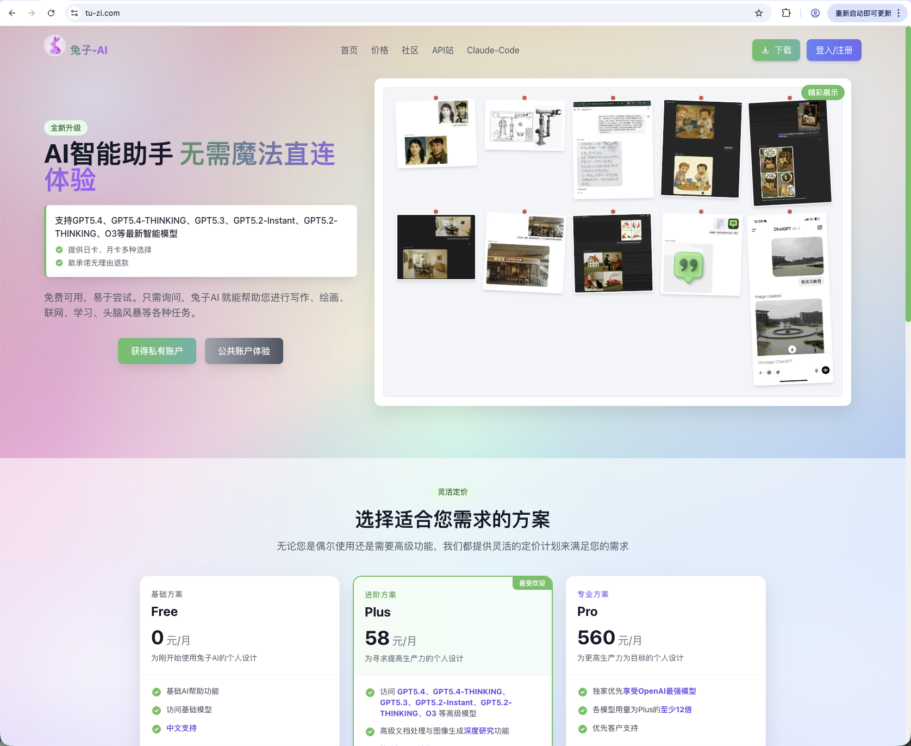
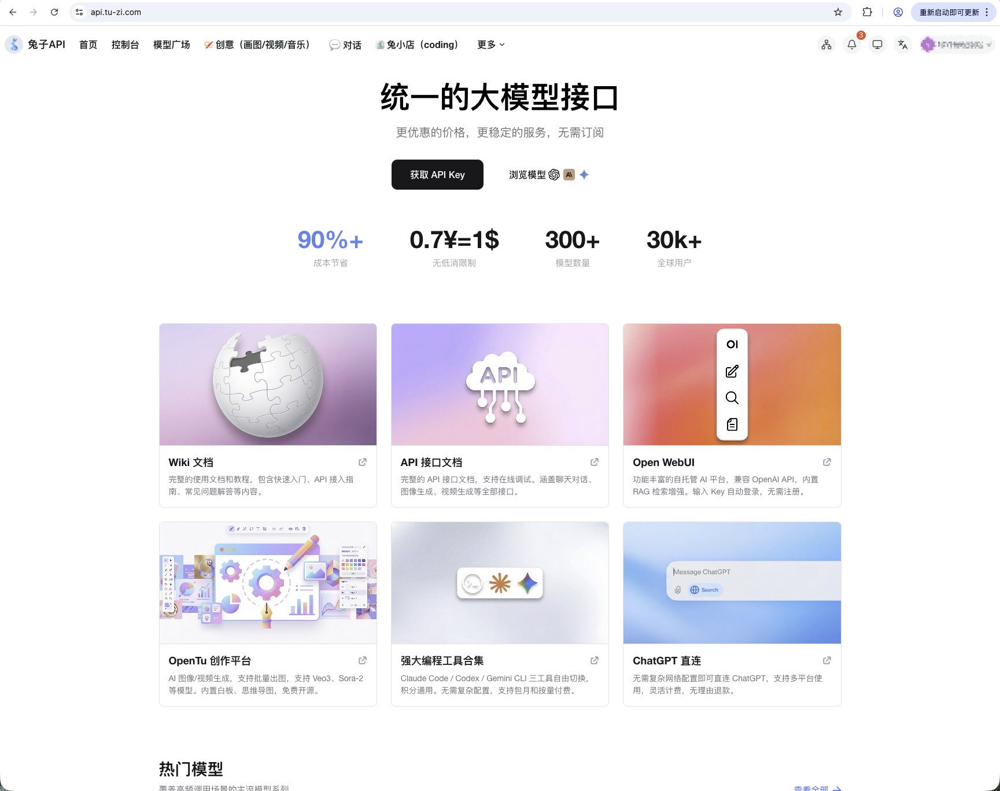
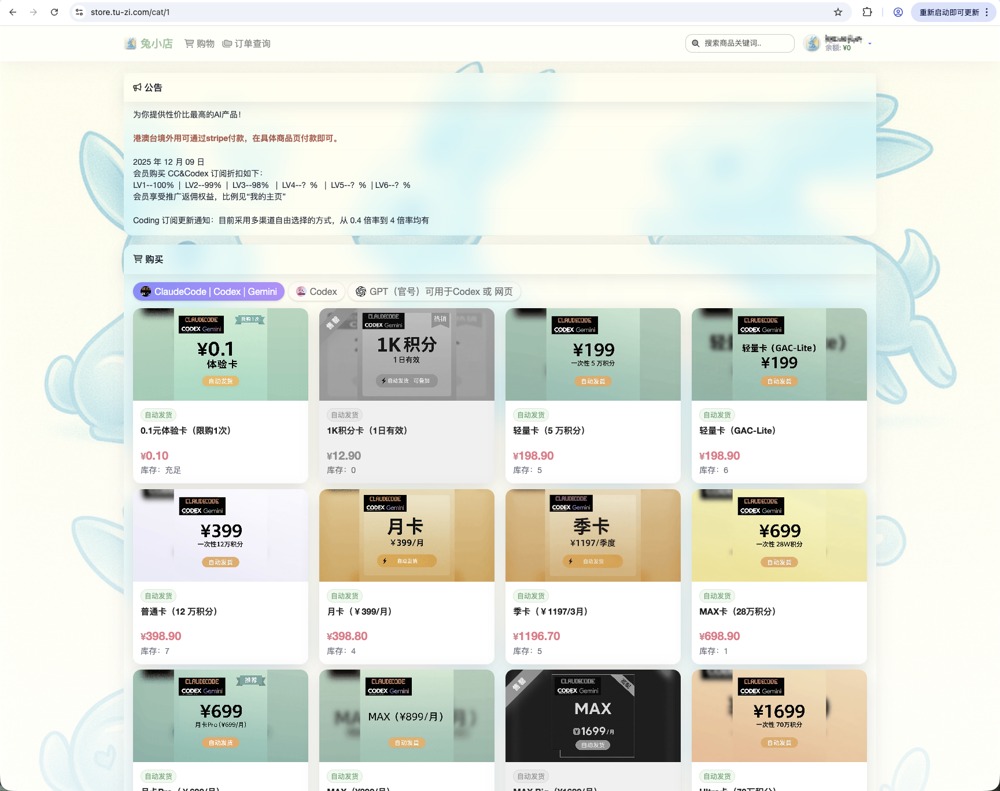
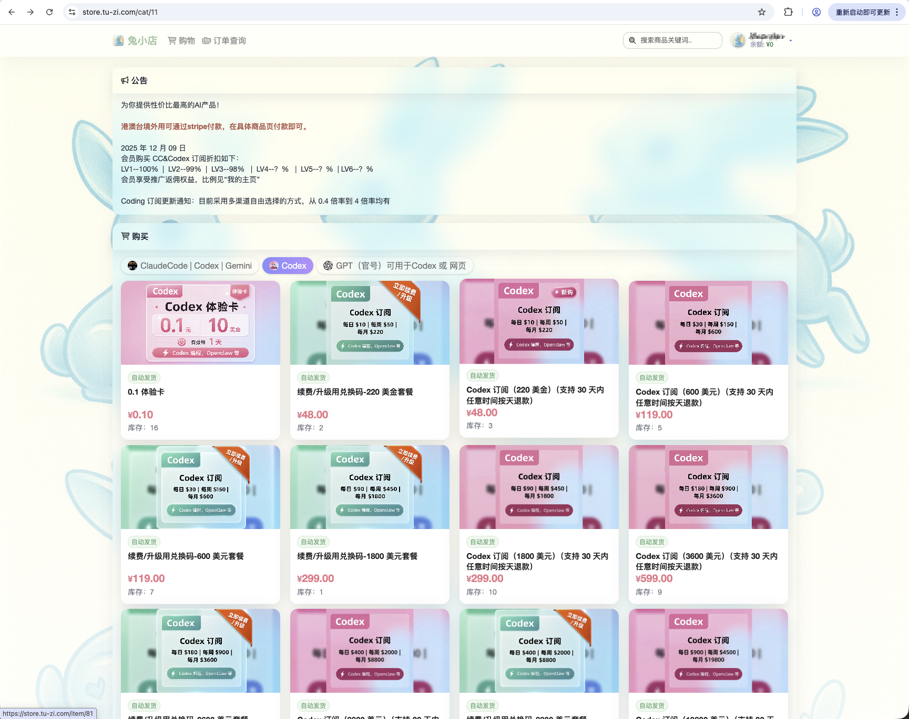
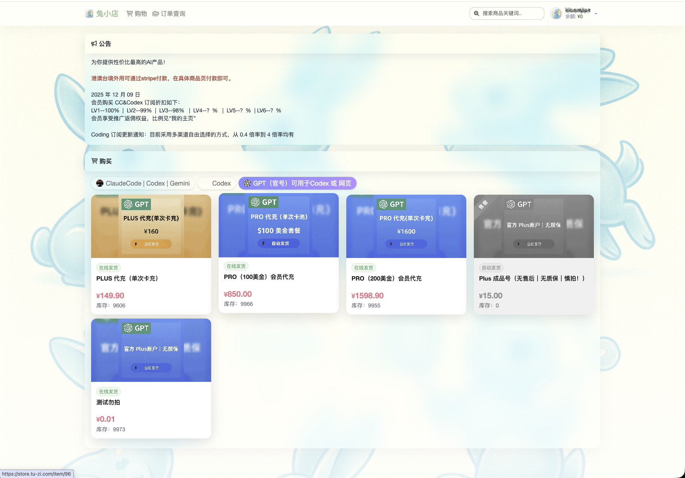

# 兔子产品矩阵

## 一、产品矩阵总览

| 产品线 | 站点 | 核心定位 | 适合人群 |
|--------|------|----------|----------|
| 兔子直连站 | [tu-zi.com](https://tu-zi.com) | 开箱即用的 AI 对话 & 创作平台 | 普通用户、内容创作者 |
| 兔子 API | [api.tu-zi.com](https://api.tu-zi.com) | OpenAI 兼容 API 聚合中转 | 开发者、调取各个模型 |
| 兔子商店 | [store.tu-zi.com](https://store.tu-zi.com) | AI 工具订阅 & 账户代充 | 重度 Claude Code / Codex 用户、需要原生账号的用户 |

---

## 二、兔子直连站（tu-zi.com）

### 无需科学上网，直接在浏览器使用顶级 AI 模型的一站式平台。



---

## 三、兔子 API（api.tu-zi.com）

### AI 模型聚合网关，将各类大语言模型统一转换为 OpenAI/Claude/Gemini 兼容接口，供个人和企业调用



---

## 四、兔小店（store.tu-zi.com）

### 兔小店，销售 Claude Code、Codex等 AI 产品订阅 以及 GPT代充、成品号

#### 1. GAC订阅



#### 2. codex订阅



#### 3. GPT代充、官号



### 订阅方案对比

| 方案 | 付费模式 | 适合场景 |
|------|----------|----------|
| 直连站 PLUS | 按月订阅 | 日常对话 & 创作，不需要接 API |
| API 按量付费 | 充值余额消耗 | 开发接入，用量不固定 |
| 订阅 | 按月订阅 | 重度 Claude Code / Codex 用户 |
| 账户代充 | 一次性充值 | 需要官方原生账号体验 |

---

## 五、三站协作关系

```
tu-zi.com          ← 普通用户直接使用 AI
    ↑
api.tu-zi.com      ← 开发者 / 客户端工具接入 API
    ↑
store.tu-zi.com    ← 购买订阅 / 充值 / 获取 API Key
```

三个站点服务同一套底层模型能力，用户可以根据使用场景自由组合：
- 只想"用 AI"→ 直连站
- 想"接 AI"进自己的产品 → API 站
- 需要"官方账号"或"包月套餐" → 商店
