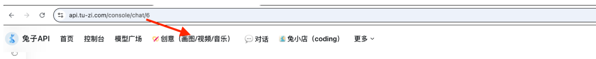
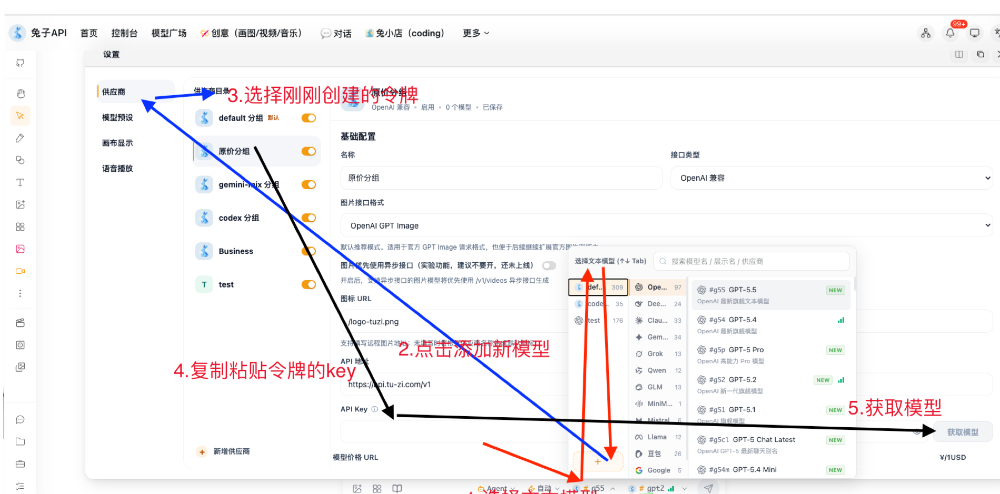
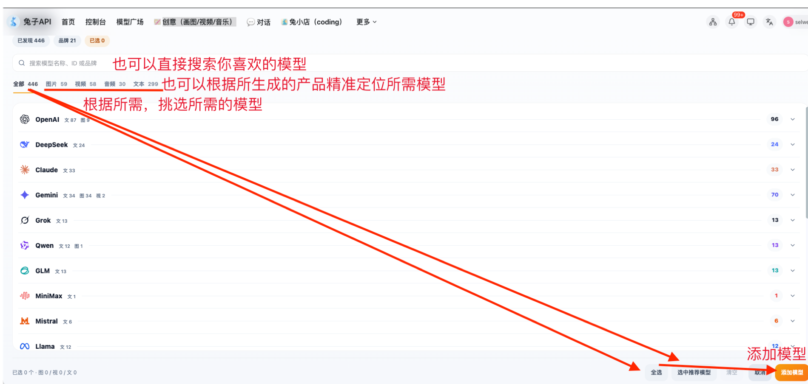
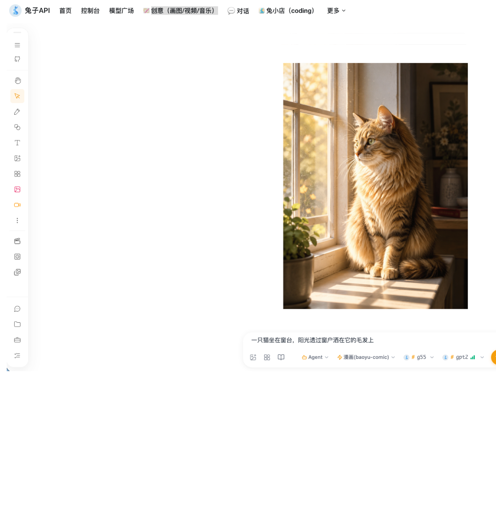

# API站点快速入门

# 一、 api key 获取

[🔐获取Key步骤](/doc/49b23582-9a23-4310-9188-d29448ae813c)

# 二、 进入 open TU （创意） 网页端工具

**2.1 获取Key以后使用网页端 或者 其他客户端均可，操作相同**

使用刚刚创建的令牌（文本模式和生图模式一样的配置方法）

**2.2 选择模型**

**2.3 开始使用**

